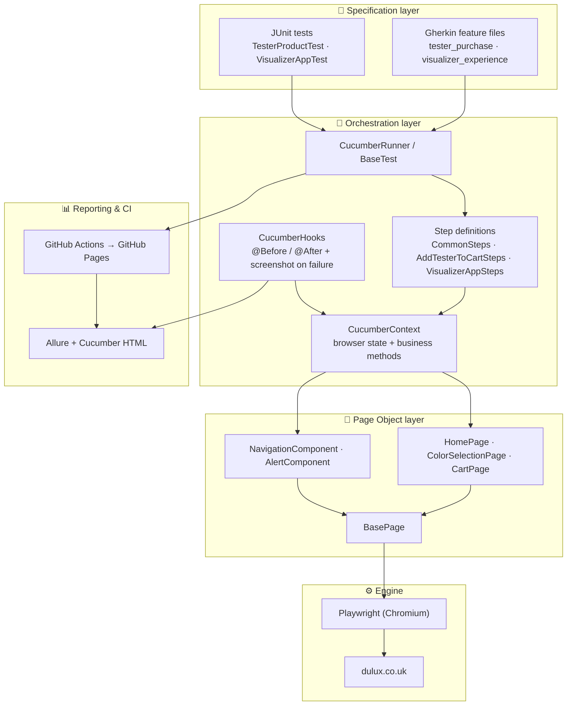

# Architecture

A layered framework: business-readable Gherkin and JUnit tests sit on top, the page layer talks to Playwright, and reporting/CI wrap the whole thing.



## Design patterns

- **Page Object Model (POM)** — each page is a class extending `BasePage` (shared `Page` field).
- **Component Objects** — reusable UI parts separated from full-page objects.
- **Base classes** — `BasePage` and `BaseTest` remove duplicated setup/teardown.
- **BDD (Given/When/Then)** — Cucumber scenarios describe behaviour, not implementation.
- **Dependency Injection** — PicoContainer injects `CucumberContext` into every step class.

## Project structure

```
src/
└── test/
    ├── java/
    │   └── com/github/magdalena/
    │       ├── cucumber/
    │       │   ├── steps/
    │       │   │   ├── CommonSteps.java           # Reusable Given/When steps (shared across features)
    │       │   │   ├── AddTesterToCartSteps.java  # Then steps for tester purchase
    │       │   │   └── VisualizerAppSteps.java    # Then steps for visualizer experience
    │       │   ├── CucumberContext.java           # Shared browser state + high-level business methods
    │       │   ├── CucumberHooks.java             # @Before / @After – screenshot on failure
    │       │   └── CucumberRunner.java            # JUnit Platform suite runner with Allure plugin
    │       ├── page/
    │       │   ├── component/
    │       │   │   ├── AlertComponent.java        # Handles alert/banner interactions
    │       │   │   └── NavigationComponent.java   # Top nav, hamburger menu, search
    │       │   └── pom/
    │       │       ├── CartPage.java              # Shopping cart page actions
    │       │       ├── ColorSelectionPage.java    # Colour picker & tester purchase
    │       │       └── HomePage.java              # Home page navigation & cookies
    │       ├── support/
    │       │   └── PlaywrightConfig.java          # Reads headless flag from system property / env var
    │       └── tests/
    │           ├── BaseTest.java                  # Shared JUnit setup / teardown
    │           ├── purchase/
    │           │   └── TesterProductTest.java     # Add colour tester to cart (desktop & mobile)
    │           └── visualizer/
    │               └── VisualizerAppTest.java     # Visualizer app new-tab flow (desktop & mobile)
    └── resources/
        └── features/
            ├── tester_purchase.feature            # BDD scenarios for TC-01 / TC-02
            └── visualizer_experience.feature      # BDD scenarios for TC-03 / TC-04
```
