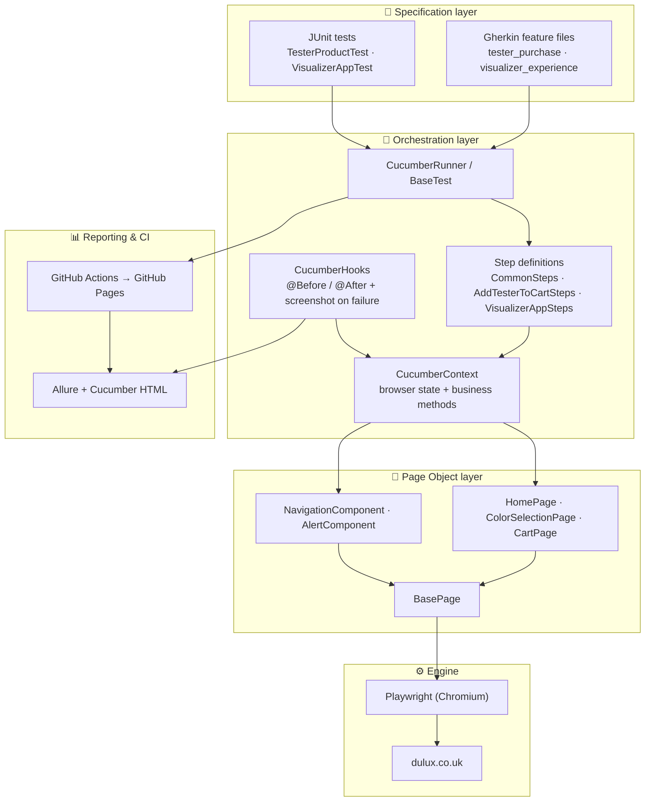

# 🏛 Architecture & Design Decisions

> How this framework is built, why it's built that way, and how it compares to its Python
> port, [playwright-python-dulux-uk](https://github.com/magdaU/playwright-python-dulux-uk).
> For *what* is tested and *why*, see the [Test Strategy](TEST_STRATEGY.md).

A layered framework: business-readable Gherkin and JUnit tests sit on top, the page layer talks to Playwright, and reporting/CI wrap the whole thing.



## Why this stack, vs. the Python port

| Concern | This project | Python port | Note |
|---|---|---|---|
| Browser automation | Playwright Java | `playwright` + `pytest-playwright` | `pytest-playwright` supplies fixtures and CLI flags for free — no hand-written `BaseTest` browser lifecycle needed on that side |
| Test runner | JUnit 5 (Jupiter + Platform Suite) | `pytest` | |
| BDD | Cucumber 7 + PicoContainer DI | `pytest-bdd` | Gherkin `@tag`s become pytest markers automatically there — pytest fixtures replace the DI container |
| Assertions | AssertJ + Playwright web-first assertions | plain `assert` + Playwright `expect()` | pytest rewrites `assert` for rich failure output — no fluent-assertion library needed there |
| Reporting | Allure (`allure-junit5` + `allure-cucumber7-jvm`) | `allure-pytest-bdd` | Standalone plugin, single dependency on the Python side |
| Visual regression | Self-hosted, `image-comparison`, non-blocking CI job | Deliberately deferred | See [Lessons Learned #4](LESSONS_LEARNED.md#4-visual-regression-implemented-here-deferred-in-the-python-sibling) |

Design principles shared by both projects: Page Object Model + Component Objects, no
assertions in page objects, role-based locators, web-first waits instead of sleeps. See
[Test Strategy §4](TEST_STRATEGY.md#4-test-approach) for the full list.

## Design patterns

- **Page Object Model (POM)** — each page is a class extending `BasePage` (shared `Page` field).
- **Component Objects** — reusable UI parts separated from full-page objects.
- **Base classes** — `BasePage` and `BaseTest` remove duplicated setup/teardown.
- **BDD (Given/When/Then)** — Cucumber scenarios describe behaviour, not implementation.
- **Dependency Injection** — PicoContainer injects `CucumberContext` into every step class.

## Project structure

```
src/
└── test/
    ├── java/
    │   └── com/github/magdalena/
    │       ├── cucumber/
    │       │   ├── steps/
    │       │   │   ├── CommonSteps.java           # Reusable Given/When steps (shared across features)
    │       │   │   ├── AddTesterToCartSteps.java  # Then steps for tester purchase
    │       │   │   └── VisualizerAppSteps.java    # Then steps for visualizer experience
    │       │   ├── CucumberContext.java           # Shared browser state + high-level business methods
    │       │   ├── CucumberHooks.java             # @Before / @After – screenshot on failure
    │       │   └── CucumberRunner.java            # JUnit Platform suite runner with Allure plugin
    │       ├── page/
    │       │   ├── component/
    │       │   │   ├── AlertComponent.java        # Handles alert/banner interactions
    │       │   │   └── NavigationComponent.java   # Top nav, hamburger menu, search
    │       │   └── pom/
    │       │       ├── CartPage.java              # Shopping cart page actions
    │       │       ├── ColorSelectionPage.java    # Colour picker & tester purchase
    │       │       └── HomePage.java              # Home page navigation & cookies
    │       ├── support/
    │       │   ├── PlaywrightConfig.java          # Reads headless flag from system property / env var
    │       │   └── VisualComparisonUtil.java      # Pixel-diff a screenshot against a committed baseline
    │       └── tests/
    │           ├── BaseTest.java                  # Shared JUnit setup / teardown
    │           ├── purchase/
    │           │   └── TesterProductTest.java     # Add colour tester to cart (desktop & mobile)
    │           ├── visualizer/
    │           │   └── VisualizerAppTest.java     # Visualizer app new-tab flow (desktop & mobile)
    │           └── visual/
    │               └── VisualRegressionTest.java  # TC-05 – TC-07, run standalone or via the non-blocking CI job
    └── resources/
        ├── features/
        │   ├── tester_purchase.feature            # BDD scenarios for TC-01 / TC-02
        │   └── visualizer_experience.feature      # BDD scenarios for TC-03 / TC-04
        └── visual-baselines/                      # Committed approved screenshots (cart-page-empty.png, ...)

docs/
├── GETTING_STARTED.md         TEST_STRATEGY.md      TEST_PLAN.md
├── FEATURES_GUIDE.md          TEST_CASES.md         TEST_RESULTS.md
├── TEST_SUMMARY_REPORT.md     architecture.md       LESSONS_LEARNED.md
└── TESTING_WITHOUT_REQUIREMENTS.md
```

## Sample test case, end to end

A real scenario from
[`tester_purchase.feature`](../src/test/resources/features/tester_purchase.feature):

```gherkin
@smoke @desktop
Scenario: Desktop customer adds a tester from the colour finder
  Given a desktop customer starts with an empty basket
  When the customer browses to shade "Violet Morning" from colour family "Violet"
  And the customer adds a tester to the basket
  Then the basket contains 1 item
  And the basket includes tester "Dulux Colour Tester" for shade "Violet Morning"
```

...bound to real Playwright actions in
[`CommonSteps.java`](../src/test/java/com/github/magdalena/cucumber/steps/CommonSteps.java)
and
[`AddTesterToCartSteps.java`](../src/test/java/com/github/magdalena/cucumber/steps/AddTesterToCartSteps.java):

```java
@Given("a {word} customer starts with an empty basket")
public void aCustomerStartsWithAnEmptyBasket(String viewport) {
    ctx.useViewport(viewport);
    ctx.openEmptyCart();
    assertThat(ctx.cartPage().getBasketEmptyText()).isVisible();
}

@When("the customer browses to shade {string} from colour family {string}")
public void theCustomerBrowsesToShadeFromColourFamily(String shade, String colourFamily) {
    ctx.browseToShade(colourFamily, shade, false);
}

@Then("the basket contains {int} item")
public void theBasketContainsItem(int quantity) {
    assertThat(ctx.cartPage().getQuantity()).hasValue(String.valueOf(quantity));
}
```

`CucumberContext ctx` is injected into every step class by PicoContainer — no test author
ever constructs it directly, and it's shared across every step of the same scenario, which
is what lets `Given`, `When` and `Then` steps in separate classes cooperate.

## Tags / markers reference

| Tag | Meaning |
|---|---|
| `@smoke` | Fast critical-path set — desktop-only, both journeys |
| `@regression` | Full journey coverage, including mobile |
| `@desktop` | Desktop-viewport (`1920×1080`) scenarios |
| `@mobile` | Mobile-viewport (`375×667`) scenarios |
| `@purchase` | Tester purchase journey |
| `@visualizer` | Visualizer experience journey |
| `visual` (JUnit `@Tag`, not a Cucumber `@tag`) | Pixel-diff checks, run standalone or via the non-blocking `visual-regression` CI job |

```bash
mvn -Dtest=CucumberRunner "-Dcucumber.filter.tags=@smoke" test
mvn -Dtest=CucumberRunner "-Dcucumber.filter.tags=@regression" test
mvn -Dtest=CucumberRunner "-Dcucumber.filter.tags=@smoke and @desktop" test
mvn -Dheadless=false test                 # watch it run in a real browser window
mvn -Dtest=VisualRegressionTest test      # visual checks only
```
